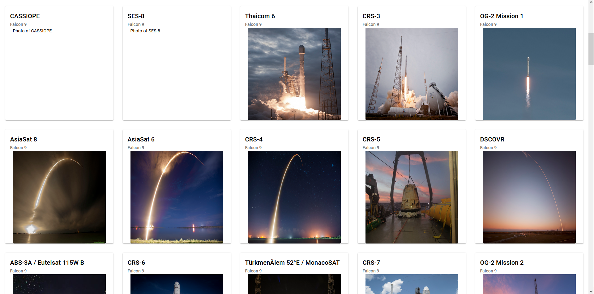
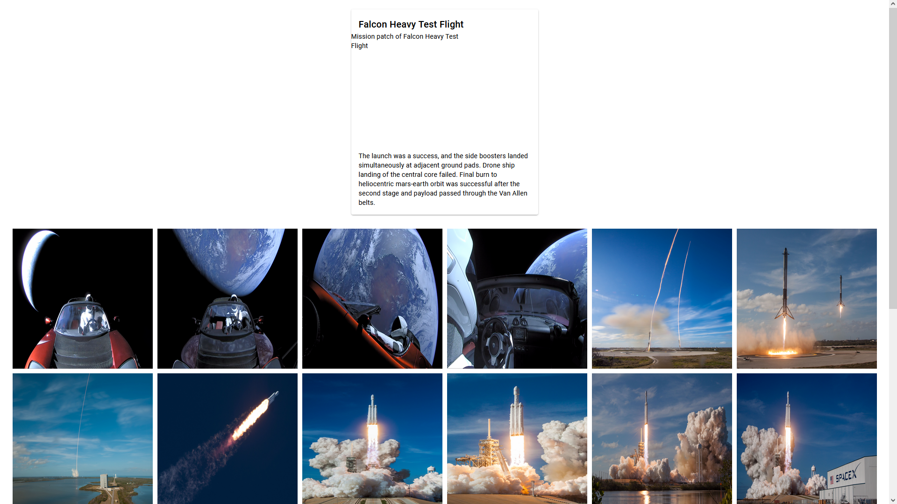

# AngularSpacexGraphqlCodegen

This project was generated with [Angular CLI](https://github.com/angular/angular-cli) version 16.2.1.

# Project Info
This project was created following instructions from https://github.com/arjunyel/angular-spacex-graphql-codegen

## Differences from base project:
- `https://api.spacex.land/graphql/` no longer operational; using `https://spacex-production.up.railway.app/` instead
- difference in command in Angular version 16.2.1: `ng g component launch-list --changeDetection=OnPush` => `ng g component launch-list --change-detection=OnPush`
- spacexGraphql.service.ts codegen: `override` was not added to document, had to add manually
- had to add optional chaining for every field and subfield in launch-list & launch-details html because every field is optional in the new API

## End Result
### Launch List page

### Launch Details page
